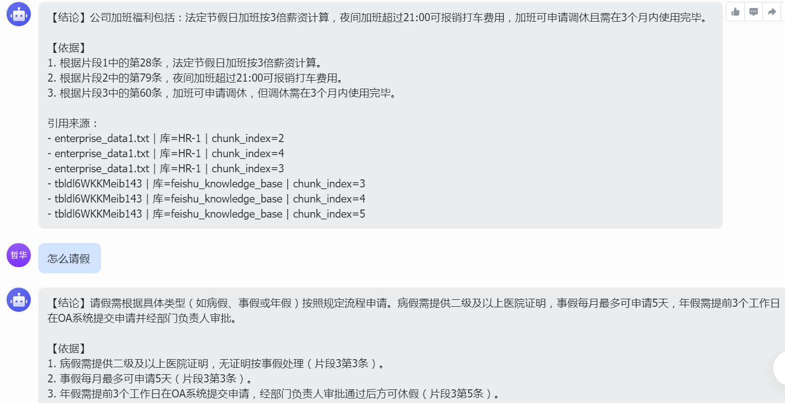

# Feishu RAG 企业知识库系统（技术展示）

## 1. 项目名称
**Feishu RAG Enterprise Knowledge Base**

> 一个面向企业场景的飞书知识库问答系统，支持多源文档入库、语义检索、可追溯问答与容器化部署。

---

## 2. Demo 展示核心功能

### 2.1 管理后台（Streamlit）
- 知识库（collection）创建 / 切换 / 删除
- 文件上传与自动入库（支持 txt/pdf/docx/xlsx 等）
- 切片管理：查看、编辑、合并、删除
- 一键清空并重导入 `data/` 文档
- 问答调试：答案 + 来源 + 检索片段详情

### 2.2 演示截图


.png)
.png)
.png)

---

## 3. 项目背景
企业知识通常分散在飞书文档、文件、表格等多个载体，传统关键词检索存在“找不到、找不准、更新慢”问题。项目目标：
- 统一知识入口，降低查询成本
- 通过 RAG 提供基于证据的自然语言问答
- 支持持续增量同步与可维护的管理后台

---

## 4. 核心功能亮点

1. **Embedding 双模式（local / api）**  
   - `EMBEDDING_PROVIDER=local|api` 一键切换
   - 生产推荐 API 模式，镜像更轻、部署更稳

2. **泛化问题增强检索（召回 + 精准平衡）**  
   - 对“请假/放假/报销/权限”等泛化问题自动扩展子查询
   - 合并去重后按重排分数排序，优先原问题语义命中

3. **严格防幻觉 + 可追溯回答**  
   - 回答优先基于检索片段
   - 支持来源展示与检索片段调试

4. **多知识库管理能力**  
   - 支持 collection 级隔离
   - 问答可指定当前知识库，避免跨库干扰

5. **自动导入与重建索引工具化**  
   - 首次自动扫描 `data/` 增量入库（哈希缓存）
   - 提供“重新自动导入 data”“一键清空并重导入 data”

6. **容器化与轻量部署**  
   - 默认 Streamlit 端口 `8511`，避免常见冲突
   - Docker 轻量依赖构建（`requirements.api.txt`）

---

## 5. 技术架构

### 5.1 架构图

```text
┌──────────────────────────── 用户入口 ────────────────────────────┐
│  飞书机器人(Webhook)     Streamlit 管理后台      REST API        │
└───────────────┬──────────────────────┬───────────────────────────┘
                │                      │
                └──────────────┬───────┘
                               ▼
┌────────────────────────── 业务编排层 ────────────────────────────┐
│  admin.py / main.py：接收请求、任务调度、状态管理                │
│  rag_chain.py：检索路由、提示词组装、答案生成、防幻觉处理         │
│  document_processor.py：解析、分块、元数据提取                   │
└───────────────┬──────────────────────┬───────────────────────────┘
                │                      │
                ▼                      ▼
┌────────────────────────── 数据与模型层 ───────────────────────────┐
│  vector_store.py + Chroma：向量写入/检索、collection 管理         │
│  Embedding：local(HF) / api(OpenAI-compatible)                   │
│  LLM：api(通义/豆包兼容) 或 ollama                               │
│  Redis(可选)：问答缓存                                            │
└───────────────────────────────────────────────────────────────────┘
```

### 5.2 数据流（简述）
1. 文档进入系统（上传 / 自动扫描 / 飞书同步）
2. 文档解析分块并写入向量库
3. 用户提问后执行检索（可做泛化扩展 + 重排）
4. LLM 基于检索证据生成答案
5. 返回答案、来源、调试片段（必要时降级返回证据）

---

## 6. 技术栈

- **后端**：FastAPI、Pydantic
- **管理端**：Streamlit
- **RAG 组件**：LangChain、Chroma
- **Embedding**：HuggingFace / OpenAI-compatible
- **LLM**：OpenAI-compatible API / Ollama
- **文档处理**：pypdf、python-docx、pandas、openpyxl
- **缓存与调度**：Redis（可选）、APScheduler
- **部署**：Docker

---

## 7. 部署与使用

### 7.1 本地运行
```bash
pip install -r requirements.txt
python main.py
streamlit run admin.py
```

### 7.2 Docker（推荐轻量版）
```bash
docker build -t keepzhe/feishu-rag:api-slim .
docker run --rm -p 8521:8511 --env-file .env keepzhe/feishu-rag:api-slim
```

访问：`http://localhost:8521`

### 7.3 关键环境变量（最小集）
```env
EMBEDDING_PROVIDER=api
EMBEDDING_MODEL=text-embedding-v3
EMBEDDING_API_KEY=***
EMBEDDING_BASE_URL=https://dashscope.aliyuncs.com/compatible-mode/v1

LLM_MODE=api
LLM_API_KEY=***
LLM_API_MODEL=qwen-plus-2025-01-25
LLM_API_BASE_URL=https://dashscope.aliyuncs.com/compatible-mode/v1
```

---

## 8. 项目结构

```text
feishu-rag/
├─ main.py                  # FastAPI 后端入口
├─ admin.py                 # Streamlit 管理后台
├─ config.py                # 配置加载与统一管理
├─ rag_chain.py             # RAG 检索与问答链
├─ vector_store.py          # 向量库管理（Chroma）
├─ document_processor.py    # 文档解析与分块
├─ feishu_client.py         # 飞书 API 封装
├─ requirements.txt         # 全量依赖（含本地模型能力）
├─ requirements.api.txt     # 轻量依赖（Docker推荐）
├─ Dockerfile
├─ .dockerignore
├─ .streamlit/config.toml   # 默认端口 8511
└─ data/
   ├─ uploads/
   ├─ chroma_db/
   └─ state/
```

---

## 9. 性能与优化（工程实践）

1. **轻量镜像策略**：默认采用 `requirements.api.txt`，显著降低镜像体积与推送失败率
2. **检索质量优化**：泛化扩展 + 重排去重，兼顾召回与精度
3. **缓存优化**：支持 Redis 问答缓存，降低重复问题耗时
4. **稳定性优化**：LLM 失败可降级返回检索证据，避免“完全不可用”
5. **运维优化**：提供可视化索引重建按钮，减少手工排障成本

---

## 10. 可展示的技术能力

- RAG 应用架构设计与落地
- 多模式模型接入（local/api）
- 检索质量优化（查询扩展、重排、去重）
- 后台可运维工具设计（重导入、切片管理、调试视图）
- Docker 化与面试可复现交付（镜像 + 命令）

---

## 11. 后续规划

- 增加可配置查询扩展词表（`.env` / 后台配置）
- 检索评估集与离线指标（Recall@k、MRR）
- 更细粒度权限过滤（按文档/部门）
- 生产监控面板（延迟、命中率、失败率）
